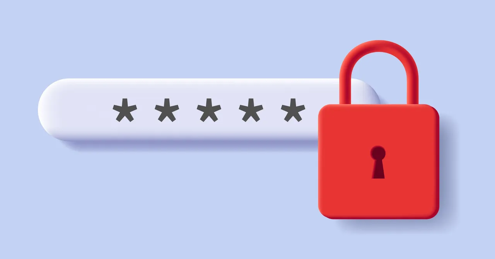

# Password Generator Dashboard

This project is a web-based password generator built with Streamlit. It provides three different methods for generating secure passwords:

- **PIN Passwords**: Numeric-only passwords of customizable length.
- **Random Passwords**: Alphanumeric passwords with optional digits and symbols.
- **Memorable Passwords**: Passwords made from random English words, with optional uppercase letters for added security.

## Features
- User-friendly web interface using Streamlit
- Customizable password length and options
- Three password generation strategies:
  - PIN (digits only)
  - Random (letters, digits, symbols)
  - Memorable (random English words)
- Downloadable password image for branding

## How to Run
1. **Install requirements:**
   ```bash
   pip install -r requirements.txt
   ```
2. **Run the app:**
   ```bash
   streamlit run src/main.py
   ```

## File Structure
- `src/main.py`: Streamlit app entry point
- `src/password_generator.py`: Password generator classes
- `images/password_image.png`: Image used in the dashboard
- `requirements.txt`: Python dependencies

## Dependencies
- streamlit
- nltk

## Notes
- The app downloads the NLTK English word list on first run.
- Memorable passwords use random English words and may contain uppercase letters for added security.


---

Feel free to customize or extend the password generation logic as needed!
